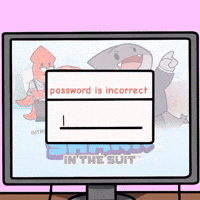

<h1 align="center">Jane The Ripper</h1>
<h4 align="center">Otherwise known as... The Password cracker!</h4>

 This program allows you to potentially crack passwords! After using the program, you might be influenced to create a stronger, less common password...so use at your own risk!

<strong>Have fun!</strong>

🤔🔒🔑💻😳🤔🔒🔑💻😳🤔🔒🔑💻😳🤔🔒🔑💻😳

## You might be wondering, how do you use this password cracker?

Below is a detailed step-by-step walkthrough of how to use the password cracker.
  

### First, how to run the program:

1. Save/copy the code. 
2. Create a new file (name it something simple that represents the code like 'Jane_the_ripper.py', or 'password_cracker.py').
3. Open your program/terminal and open the file you created.
4. Press the play icon (▶️) to run the script in the terminal!
 

##  How to run the password cracker after opening the program:

- **REMEMBER: An MD5 hash is a function that generates a unique, 32-character hexadecimal string, from any input data**

1. 👋 | The Password Cracker will give you a quick welcome message.
2. 🤔 | Next, the password cracker will ask you for the path to your **hash** file. This is the file that contains a list of 'stolen' MD5 password hashes. If you are using the pre-given hash file input: "hashes.txt".If you are inputting your own hash file, it must look similar to the pre-given hash file within this repository: **(screenshot of hash file on vs code)**
- 
3. 👍👎 | Next, the password cracker will ask you for the path to your **wordlist** file. This is the file that contains a dictionary of common password guesses. If you are using the pre-given wordlist file input: "wordlist.txt". If you are inputting your own wordlist file, it must look similar to the pre-given wordlist file within this repository: **(screenshot of wordlist file on vs code)**
- 

4. 🔍 | Finally, your code is shown
5. 🎯 | Your GPA calculator will ask you what your GOAL GPA is. Input your goal GPA, **Remember to only input numbers**, after inputting your goal GPA, press enter. 
6. 🥳 | If your GOAL GPA is already met, you will get a congratulation message! 
7. ↕️ | **If step 6 does NOT apply to you**, the code will tell you what your new GPA would be if one class grade per cycle was raised to a 4.0. If your lowest classes grade was raised to 4.0, and your goal GPA still wasn't met, then a message will be displayed saying you will need to improve more than one class. 

### Want to create your own MD5 hash?

I see, you're interested in creating your own MD5 hash...! Here's a simple step by step tutorial on how to do that: 
1. Create a new file on VS Code, name it something simple and clear like 'create_MD5_hash.py'.
2. Input the same code used in this image: **(Image of vs code and file)**
3. Alter the information where the reference uses '#' (hastags). 
4. Press the play icon (▶️) to run the script in the terminal!
5. View your hashed password in your terminal!

<h2 align="center">Happy Password Cracking!</h2>
 
 

   
 
  